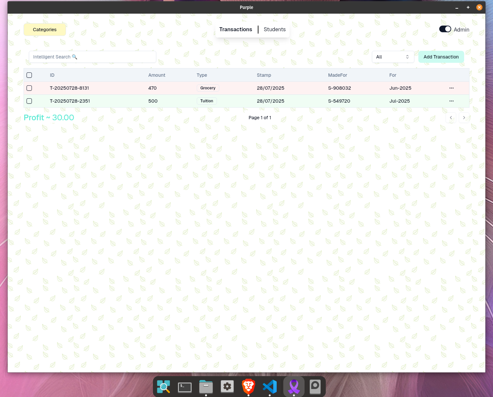
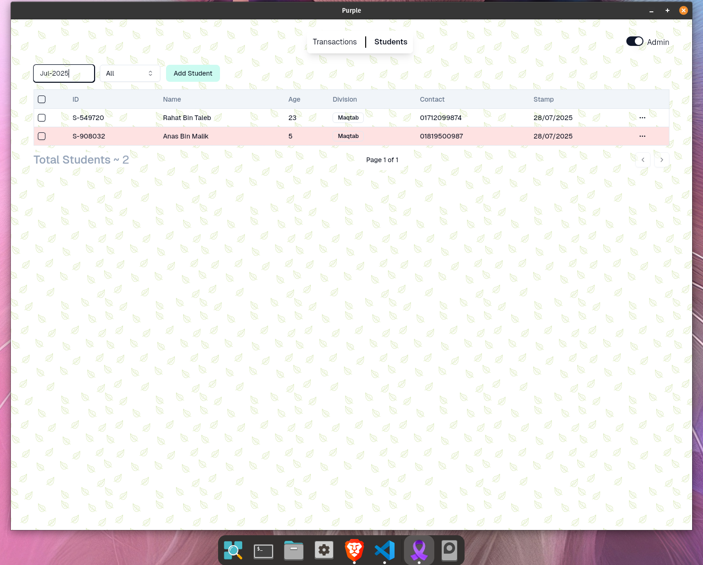

# 🟣 Purple

**Purple** is a lightweight, secure desktop application designed for managing financial transactions and student records at the Islamic institute **Anas Bin Malik (Ra)**. Built with cutting-edge technologies, Purple delivers a high-performance, intuitive experience powered by a Rust backend and a fast SolidJS frontend.

---

## ✨ Features

- **CRUD Operations**  
    Manage students and transactions seamlessly with full create, read, update, and delete support.

- **Automatic Student Counting**  
    Keep track of student numbers with zero manual effort.

- **Profit & Loss Analysis**  
    Automatically calculates institute profit or loss for clear financial insights.

- **Advanced Transaction Filtering**  
    Filter transactions by ID, type, purpose, or date ranges using an intelligent, unified input box.

- **Year-Specific Queries**  
    Retrieve all transactions made by a student within a specified year.

- **Subfiltering by Class/Division**  
    Narrow down student lists by class or division for fine-grained management.

- **Visual Highlights**  
    - Transactions are color-coded: green for income, red for expenses.
    - Students with unpaid tuition fees are **highlighted in red**.

- **Admin Mode**  
    Toggle between viewer and admin modes to enable editing and deletion of transactions and student records.

- **Dynamic Category Management**  
    Create and manage transaction categories dynamically for organized financial tracking.

- **Fast, Efficient Data Handling**  
    Uses SQLite for reliable data storage, combined with Drizzle and SQLx for blazing-fast query execution.

- **Modern UI**  
    Powered by SolidJS with shadcn Solid components, providing the fastest LCP (Largest Contentful Paint) times and a smooth user experience.

- **Robust Backend**  
    Written in Rust for hardware interaction capabilities such as printing, ensuring the application is lightweight and highly performant.

- **Receipt Generation**
    Generate Money Recipt from Student and Transaction information and print in a single click for giving it to the guardians of the students!

---

## 🚀 Upcoming Features

- **Automated and Individual SMS Broadcasting**  
    Send announcements or reminders to students directly via SMS from within the app.

---

## 🛠️ Tech Stack

| Technology         | Purpose                                      |
|--------------------|----------------------------------------------|
| **Tauri**          | Secure, lightweight desktop application      |
| **Rust**           | Backend logic & hardware interfacing         |
| **SQLite**         | Embedded database for efficient local storage|
| **Drizzle & SQLx** | High-performance query builders/executors    |
| **SolidJS**        | UI rendering library optimized for speed     |
| **shadcn/components** | Prebuilt UI components for consistent design |

---

## 📸 Screenshots

---

## 🏁 Getting Started

1. **Clone the repository**
2. **Install Rust and Node.js dependencies**
3. **Run the build scripts** for both backend (Rust) and frontend (SolidJS)
4. **Launch the application** via Tauri
5. **Start managing** your institute’s transactions and student records with ease

---

## 📄 License

This project is licensed under the **MIT License**.

---

> Thank you for using **Purple** — simplifying Islamic institute management with speed, security, and intelligence.
